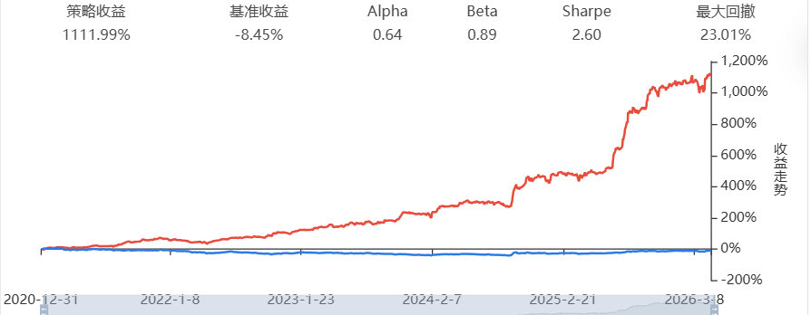

# Easy-Quant

个人量化策略开发仓库，持续迭代中。代码适配 Supermind / MindGo 回测框架。

## 目录结构

```
Easy-Quant/
├── V1_Basic/                         # 历史版本归档
│   └── strategy.py                   # V1 多因子动量策略
├── V2_Decillion/                     # 当前主力版本
│   ├── research_v2_final.py          # 信号生成：LightGBM 多因子截面轮动
│   ├── research_v2_hmm_explore.py    # 实验记录：HMM 宏观择时（已弃用）
│   └── trade_v2_final.py             # 回测执行引擎
├── assets/
│   └── backtest_v2.png                # V2 回测曲线
├── LICENSE
└── README.md
```

## 策略演进

### V2 — Project Decillion (2026.04)

纯多头截面轮动策略。在传统动量因子上扩展波动率异动与量价背离因子，通过 LightGBM 进行非线性特征挖掘，截面采用预测得分平方加权分配头寸，配合 12% 移动止损控制尾部风险。

| 指标 | 数值 |
|:---|---:|
| 累积收益率 | 1111.99% |
| 夏普比率 | 2.60 |
| 最大回撤 | 23.01% |
| 数据区间 | 2021.01 — 2026.04 |



**探索过程**：早期引入 HMM 隐马尔可夫模型进行大盘状态择时（`research_v2_hmm_explore.py`），回测显示 2022 年熊市中有效规避下跌，但在 2023–2025 震荡市中状态漂移严重、频繁踏空。最终版本放弃择时，回归截面 Alpha 挖掘本身。

### V1 — 多因子动量框架

双均线大盘风控 + 20 日动量选股 + RSI/Donchian 突破择时 + 10% 动态追踪止损的复合策略。完整代码归档于 `V1_Basic/strategy.py`。

| 指标 | 数值 |
|:---|---:|
| 累积收益率 | 490.66% |
| 夏普比率 | 1.68 |
| 最大回撤 | 17.48% |


## 技术栈

- Python 3.x
- LightGBM — 非线性因子合成
- pandas / numpy — 数据处理与特征工程
- hmmlearn — V2 实验版 HMM 状态识别（当前版本不依赖）

## 本地开发

```bash
git clone https://github.com/CryptoDuzey/Easy-Quant.git
cd Easy-Quant
pip install lightgbm pandas numpy hmmlearn
```

## 免责声明

本仓库所有内容仅供量化研究参考，不构成任何投资建议。历史回测表现不代表未来收益。
