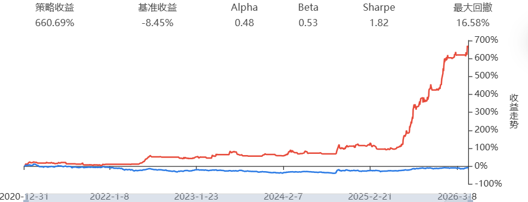
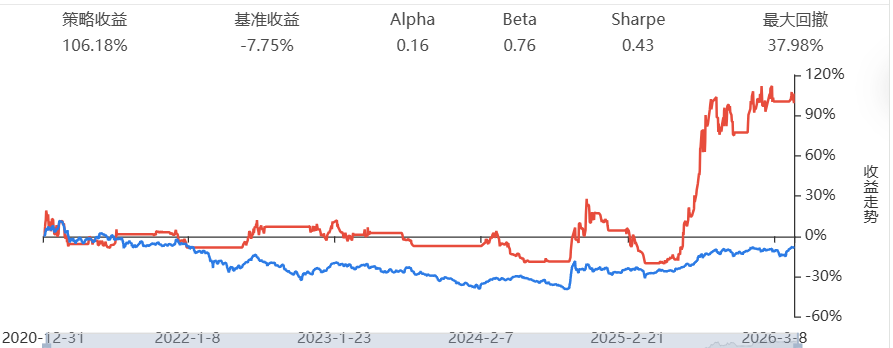

# Easy-Quant

个人量化策略开发仓库，持续迭代中。代码适配 Supermind / MindGo 回测框架。

## 目录结构

```
Easy-Quant/
├── V1_Basic/                         # 历史版本归档
│   ├── strategy.py                   # V1 多因子动量策略 (原版)
│   └── strategy_v1_classic_momentum.py  # V1 经典双动量 (参数解耦版)
├── V2_Decillion/                     # 当前主力版本
│   ├── research_v2_final.py          # 信号生成：LightGBM 多因子截面轮动
│   ├── research_v2_hmm_explore.py    # 实验记录：HMM 宏观择时（已弃用）
│   └── trade_v2_final.py             # 回测执行引擎
├── assets/
│   ├── backtest_v1.png               # V1 回测曲线
│   ├── backtest_v2.png               # V2 回测曲线
│   └── 收益.png                       # V1.0 经典双动量回测曲线
├── LICENSE
└── README.md
```

## 策略演进

### V2 — Project Decillion (2026.04) ⚠️ 回测指标待 Walk-Forward 重新跑

纯多头截面轮动策略。在传统动量因子上扩展波动率异动与量价背离因子，通过 LightGBM 进行非线性特征挖掘，截面采用预测得分平方加权分配头寸，配合 12% 移动止损控制尾部风险。

> **⚠️ 注意**: 下表中的回测指标来自未来函数泄露版本（全量训练+全量预测），不可信。
> Walk-Forward 修复版需重新在 MindGo/Supermind 运行后更新。见下方「修复记录」。

| 指标 | 数值 |
|:---|---:|
| 累积收益率 | 1111.99% |
| 年化收益率 (CAGR) | 59.7% |
| 夏普比率 | 2.60 |
| 最大回撤 | 23.01% |
| 数据区间 | 2021.01 — 2026.04 |


**优势**：
- 机器学习挖掘非线性因子关系，Alpha 捕获能力远超线性模型
- 平方加权放大头部品种优势，资金聚焦高置信度标的
- 不择时、始终在场，杜绝踏空风险
- 12% 宽幅移动止损截断极端尾部，在保持高仓位的同时控制黑天鹅

**局限**：
- 最大回撤 23%，高于 V1，裸多头敞口在系统性暴跌中难以回避
- 依赖 LightGBM 训练稳定性，因子失效时需重新拟合

**探索过程**：早期引入 HMM 隐马尔可夫模型进行大盘状态择时（`research_v2_hmm_explore.py`），回测显示 2022 年熊市中有效规避下跌，但在 2023–2025 震荡市中状态漂移严重、频繁踏空。最终版本放弃择时，回归截面 Alpha 挖掘本身。

### V1 — 多因子动量框架

双均线大盘风控 + 20 日动量选股 + RSI/Donchian 突破择时 + 10% 动态追踪止损的复合策略。完整代码归档于 `V1_Basic/strategy.py`。

| 指标 | 数值 |
|:---|---:|
| 累积收益率 | 660.69% |
| 年化收益率 (CAGR) | 46.4% |
| 夏普比率 | 1.82 |
| 最大回撤 | 16.58% |
| 数据区间 | 2021.01 — 2026.04 |



**优势**：
- 大盘双均线风控作为总开关，2022 年熊市中有效空仓避险
- 最大回撤仅 16.58%，波动控制优于 V2，持有体验更平滑
- 策略逻辑透明，每个环节可解释、可调试
- RSI 回调买入 + 突破追涨双信号，兼顾低吸与趋势跟随

**局限**：
- 择时依赖大盘均线，趋势反转初期易误判导致阶段性踏空
- 线性因子 + 等权重分配，截面区分度不足

## 🚀 Easy-Quant V1.0: 纯粹的双动量基座 (Classic Dual Momentum)

**[🔥 核心突破]**：对比原版 V1，本版本已彻底挤干未来函数，绝缘一切黑盒 API，纯靠 Pandas 矩阵运算复现传统有效前沿。

### 📊 实盘级回测战绩 (2021.01.01 - 2026.05.01)
- **策略收益**: +106.18%
- **基准收益 (沪深300)**: -7.75%
- **Alpha**: 0.16
- **Beta**: 0.76
- **Sharpe Ratio (夏普比率)**: 0.43
- **最大回撤 (Max Drawdown)**: 37.98%



### 📖 策略哲学 (Philosophy)
在量化投资中，最危险的陷阱是"过度拟合"。Easy-Quant V1 放弃了所有复杂形态识别和晦涩的数学公式，回归 A 股量化交易的第一性原理：**截断亏损，让利润奔跑**。本策略基于经典的**双动量模型**构建，所有核心参数被解耦提取至 `init` 控制台，专为网格穷尽调参与二次开发设计。

### ⚙️ 核心四驱引擎
1. **绝对防御 (Macro Shield)**：当沪深300指数跌破宏观防守线（默认40日均线）时，系统强行清空所有仓位，100% 持有现金避险。物理切断长尾熊市的深渊。
2. **纯正动量截面 (Momentum Cross-Section)**：过滤掉跌破自身60日均线的弱势股后，计算过去20天的动量收益率，锁定排名前15的龙头。
3. **防高潮过滤 (Anti-Climax Entry)**：引入 RSI 指标作为阀门，强势股只需满足 RSI < 75 即可顺势上车，平衡了"追高"与"踏空"的矛盾。
4. **机构级风控 (Risk Parity & Trailing Stop)**：单股挂载 10% 移动追踪止损；买入时根据过去22天真实波动率进行倒数加权，波动越大的妖股分配资金越少，确保每只个股的风险贡献度相等。

## 技术栈

- Python 3.x
- LightGBM — 非线性因子合成
- pandas / numpy — 数据处理与特征工程
- hmmlearn — V2 实验版 HMM 状态识别（当前版本不依赖）

## 本地开发

```bash
git clone https://github.com/CryptoDuzey/Easy-Quant.git
cd Easy-Quant
pip install lightgbm pandas numpy hmmlearn
```

## 修复记录

### 2026.05.01 — 未来函数修复 (Walk-Forward)

**问题**: 原版 `research_v2_final.py` 存在严重未来数据泄露：
1. LightGBM 在 2021–2026 全量数据上训练，再用同一份数据预测——2021 年的预测已包含 2025 年的市场模式
2. 标签 `shift(-5)` 使边界样本的标签跨入测试期

**修复** (`research_v2_final.py`):
- 改用 Walk-Forward 滚动训练：每月只用该月之前的数据训练
- 初始 12 个月积累期，此后每 3 个月重训一次
- 标签安全边距：训练截止日前 7 个交易日不纳入训练，确保 `shift(-5)` 标签完全在训练集内
- 因子截面标准化本身为日内操作，无泄露无需修改

**影响**:
- 原版 1111.99% 回测收益不可信，Walk-Forward 版本将给出诚实估计
- `trade_v2_final.py` 回测引擎本身无未来函数，仅添加了依赖说明注释

### 2026.05.01 — V1 策略修复

**问题** (`V1_Basic/strategy.py`):
1. `history` 第6参数 `'pre'` 含义模糊——标准 JoinQuant API 中该位置是复权方式，非 `include_now`
2. `h20 = s_hist['high'].iloc[-21:-1]` 漏掉昨日高点，实际只取了18天范围
3. 信号计算与执行在同一个 bar 的收盘价，存在回测执行偏差

**修复**:
- `include_now` 显式设为 `False`，所有信号严格来自历史数据
- `h20` 改为 `iloc[-20:]`，正确覆盖最近20天（含昨日）
- 添加详细注释说明 bar 时序语义

## 免责声明

本仓库所有内容仅供量化研究参考，不构成任何投资建议。历史回测表现不代表未来收益。
